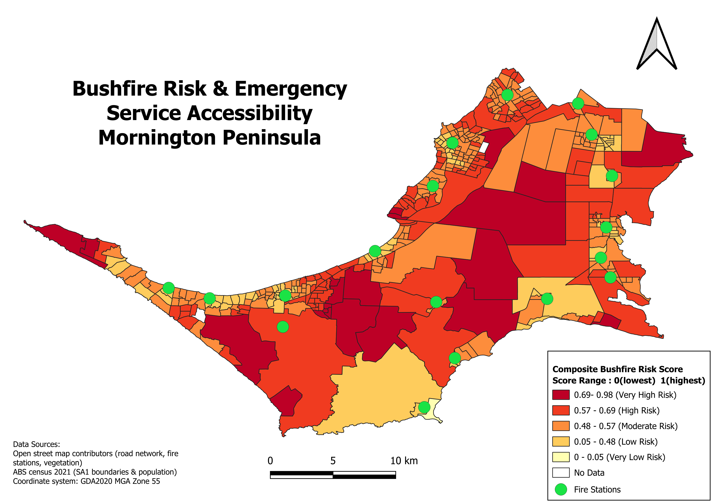

# Bushfire Risk & Emergency Service Accessibility – Mornington Peninsula

## Overview
This project analyzes bushfire risk and emergency service accessibility across the Mornington Peninsula, Victoria, Australia, at the SA1 (Statistical Area Level 1) census unit scale. It combines a network-based accessibility analysis (distance to the nearest fire station via the road network) with a proximity-based vegetation risk factor to produce a composite bushfire risk score for each SA1.

This is part of a QGIS portfolio series focused on spatial analysis of the Mornington Peninsula.

## Objective
To identify which areas of the Mornington Peninsula face the greatest combined risk from bushfire exposure and limited access to emergency fire services, in order to support emergency planning and resource allocation.

## Methodology

### 1. Data Preparation
- Study area boundary and SA1 population data sourced from the ABS Census 2021 (SA1 level), clipped to the Mornington Peninsula LGA
- Road network and fire station locations extracted from OpenStreetMap using the QuickOSM plugin (`highway=*`, `amenity=fire_station`)
- Vegetation (forest and woodland) extracted from OpenStreetMap (`landuse=forest`, `natural=wood`)
- All layers reprojected to **GDA2020 MGA Zone 55 (EPSG:7855)** for accurate distance/area calculations
- Fire station polygons converted to centroid points and merged with point features into a single `fire_stations_all` layer (18 stations)
- SA1 polygons converted to representative points (point-on-surface) to serve as origin points for network analysis

### 2. Emergency Service Accessibility (Network Analysis)
- Used the **QNEAT3** plugin's Origin-Destination Matrix tool (m:n, shortest path) to calculate the road-network travel distance from each SA1's population point to every fire station
- Origins: SA1 population points | Destinations: fire stations | Network: OSM road lines (clipped to study area)
- Entry/exit cost method set to **Planar** (required for projected coordinate systems)
- Used "Statistics by Categories" to extract the minimum distance to the nearest fire station per SA1
- 397 of 404 SA1s were successfully calculated; 7 SA1s (~1.7%) returned no result due to road network connectivity gaps and were excluded (shown as "No Data" on the map)

### 3. Bushfire Risk Factor (Vegetation Proximity)
- An initial attempt to use the Victorian Government's Designated Bushfire Prone Area (BPA) dataset was discontinued, as it is a binary (designated/not designated) layer covering nearly the entire LGA and does not differentiate risk between SA1s
- Instead, proximity to dense vegetation (forest/woodland) was used as a proxy risk indicator, based on the principle that proximity to vegetation fuel load increases bushfire risk
- Calculated using "Join Attributes by Nearest" from each SA1 point to the nearest vegetation polygon

### 4. Composite Risk Score
Both distance measures were normalized to a 0–1 scale and combined into a single index:

```
norm_fire = (distance_to_fire_station - min) / (max - min)          → higher = further = riskier
norm_veg  = 1 - (distance_to_vegetation - min) / (max - min)        → higher = closer to vegetation = riskier

Risk_score = 0.5 × norm_fire + 0.5 × norm_veg
```

The composite score was classified into 5 categories using **Natural Breaks (Jenks)**:

| Risk Category | Score Range |
|---|---|
| Very Low Risk | 0 – 0.05 |
| Low Risk | 0.05 – 0.48 |
| Moderate Risk | 0.48 – 0.57 |
| High Risk | 0.57 – 0.69 |
| Very High Risk | 0.69 – 0.98 |

## Results
*(Fill in from the attribute table / Statistics panel in QGIS — select `SA1_FireRisk_combined`, use the Field Calculator or Statistics panel on `Risk_score`, or run "Basic Statistics for Fields" to get counts/percentages per class.)*

- Total SA1s analyzed: 404 (397 with valid scores, 7 excluded)
- % of population in Very High / High Risk areas: *[to add]*
- % of population in Low / Very Low Risk areas: *[to add]*
- General pattern: inland and vegetated central areas show the highest composite risk, while coastal and more built-up areas near fire stations show lower risk

## Map Output


## Tools & Technologies
- QGIS 3.x
- Plugins: QuickOSM, QNEAT3 (Network Analysis)
- Coordinate Reference System: GDA2020 MGA Zone 55 (EPSG:7855)

## Data Sources
- **OpenStreetMap contributors** — road network, fire stations, vegetation (forest/woodland)
- **Australian Bureau of Statistics, Census 2021** — SA1 boundaries and population

## Limitations
- The composite risk score is a simplified proxy index (equal-weighted average of two factors) and does not incorporate fuel load intensity, slope, wind exposure, or historical fire occurrence data
- 7 SA1s (~1.7%) were excluded due to road network connectivity issues in the OD Matrix calculation
- OpenStreetMap data completeness varies by area and may under-represent some vegetation or road features

## Author
Shiva Shanaki
